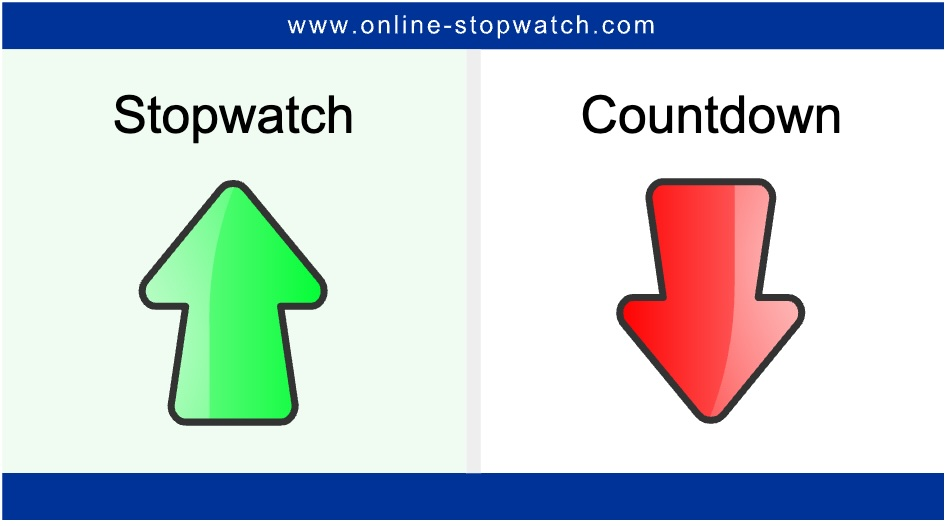
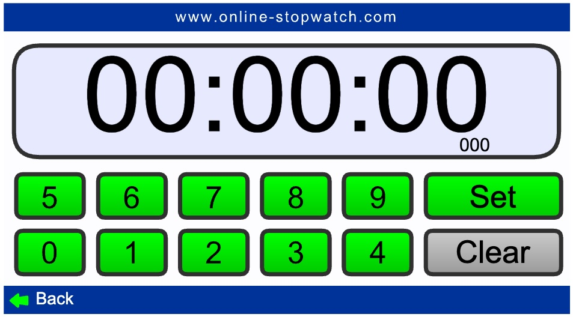
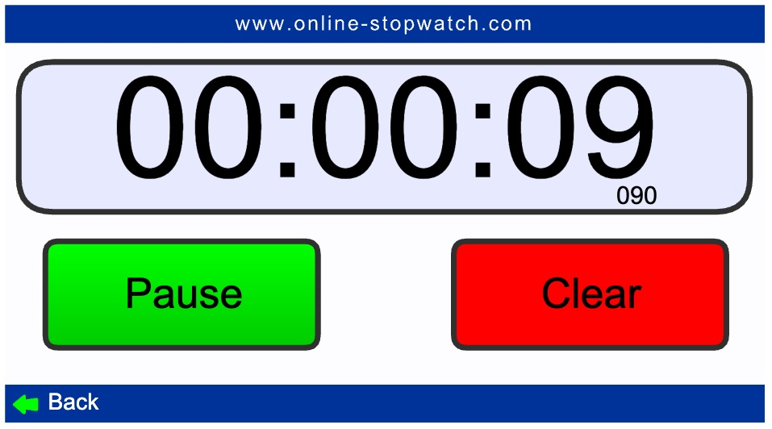

# Prompt Engineering
## AI4Devs - Session 2 - Prompt Engineering
## Claudio Salvador Rivas Anguiano
## Algoritmo - ChatGPT o1
Ejercicio de Prompt Engineering

## Instrucción
Utiliza lo aprendido sobre prompt engineering para crear un cronómetro y cuenta atrás.
Referencia: 🔗Online Stopwatch  (ver res/stopwatch.png, referencia de diseño)
Hazlo apoyado en el seed index.html + script.js que proporcionamos.
Utiliza un chatbot, como ChatGPT, Gemini o Claude, no un asistente de código en IDE como Github Copilot.
Tip: si permite el análisis de imágenes, puedes subirla para obtener fácilmente un diseño similar al de referencia.
Para entregar, haz una pull request que incluya una carpeta copiada de template, con el nombre stopwatch-iniciales (ejemplo stopwatch-ARM). Debe incluir no solo el código generado, sino también, fundamental, el prompt utilizado y el chatbot utilizado en prompts.md. Si has usado más de un prompt hasta llegar a una solución adecuada, añade todos en orden. Añade además el prompt final en el comentario del pull request.

## Prompt inicial

# Aplicación de cronómetro y temporizador

## Instrucciones generales previa a generación del requerimiento
Antes de generar cualquier respuesta analiza el prompt, de ser necesario aplica cualquier mejora al mismo, pregunta todo lo que consideres necesario, tomate el tiempo que consideres necesario, analiza paso a paso e itera conforme sea necesario hasta obtener un resultado favorable y similar a las imágenes añadidas como ejemplo.

## Requerimiento
Genera una aplicación que ofresca inicialmente un menú con dos opciones:
1. Temporizador
2. Cronómetro

### Temporizador
El temporizador deberá permitir establecer el tiempo que el usuario desea en formato HH:MM:SS (hora, minuto, segundo) y contar con un botón para que inicie la cuenta regresiva, el usuario tendrá visible el temporizador junto con un botón de detener y uno de reset. Al finalizar deberá escucharse un sonido de alarma como sirena de ambulancia, el cual se detendrá al presionar el botón "Detener".El botón de "Detener", detendrá la cuenta regresiva y silenciará la alarma, mientras que el botón de reset detendrá la cuenta regresiva y reiniciará el tiempo al valor establecido inicialmente por el usuario además de silenciar la alarma. El usuario tembién contará con una función para regresar al menú principal, la cual detendrá el temporizador también.

### Cronómetro
La función de cronómetro avanzará el tiempo en un cotador en formato HH:MM:SS, contabilizando segundo a segundo en la interfaz de usuario y aumentando los minutos y las horas conforme el tiempo avanza. El usuario tembién contará con una función para regresar al menú principal, la cual detendrá el temporizador también.

### Formato de resultado esperado
La aplicación deberá entregarse en formato Web, teniendo las mejores prácticas para segmentar el código en formato (CSS), documento base (HTML), y la funcionalidad dinámica (Javascript).

### Requerimientos no funcionales y estéticos
Los nombres de los botones deberán ser ingeniosos y divertidos además que la interfaz gráfica debe ser colorida y divertida.

Imágenes de ejemplo
Ejemplo del menú

Ejemplo de configuración de Temporizador

Ejemplo de Temporizador corriendo

Ejemplo de cronómetro corriendo
